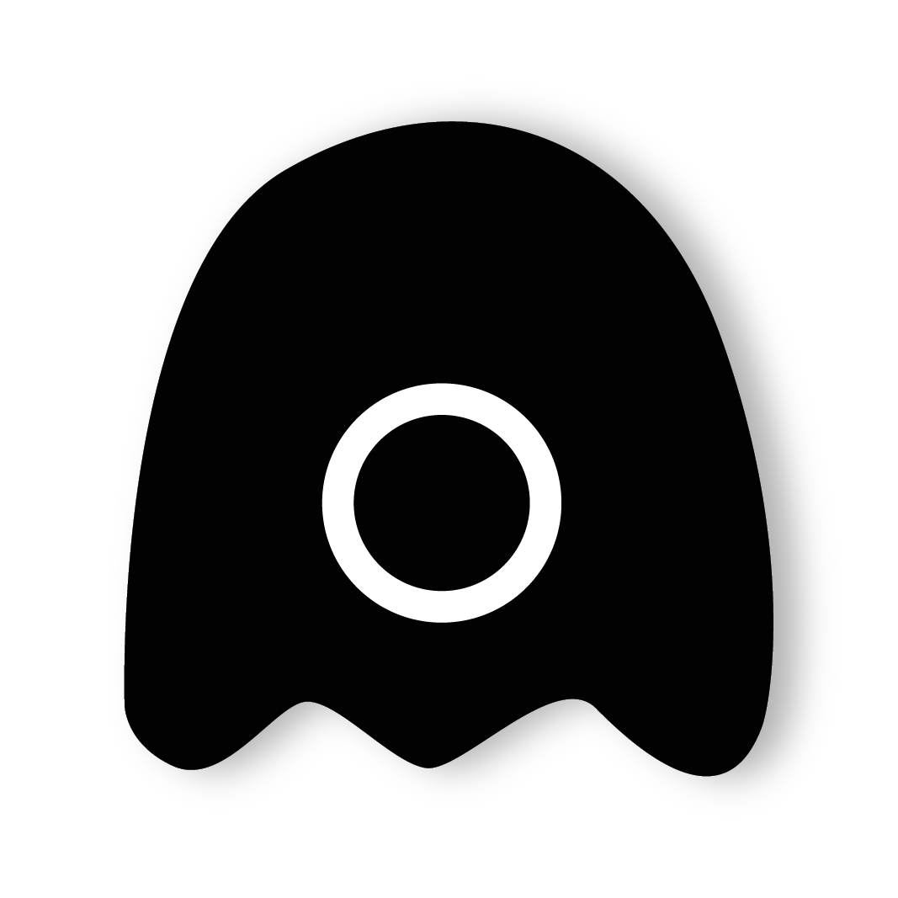
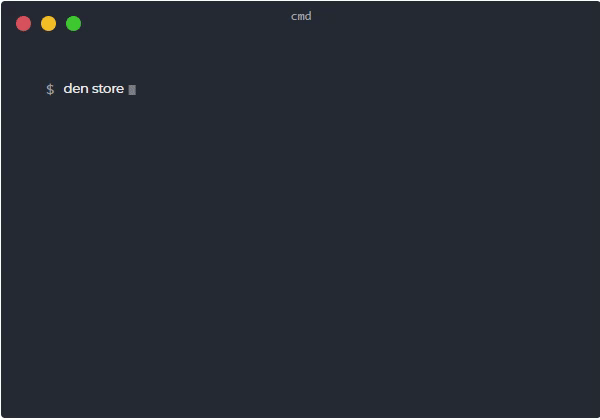

🎉 Open Source Cli Tool for Windows | Linux | Mac OS

den is a interactive cli tool to store, manage password data without any third party services.

&nbsp;
&nbsp;
<p align="center">
  <br/>
  <span><strong>Den Cli Tool</strong></span>
</p>
&nbsp;

[](https://github.com/prakashjaw/den) 
[](https://github.com/prakashjaw/den/blob/master/LICENSE)
[](https://github.com/prakashjaw/den) 
[](https://denapp.now.sh)
[](https://prakashjaw.bss.design) 

&nbsp;

### Installation

Den requires [Node.js](https://nodejs.org/) and npm (Node Package Manager).

Before running this set the storage path in the source code

```cmd
npm install -g ./
```
<p align="center">

</p>

### Description

Den comes with more handy cli commands that can be accessed anywhere from your computer.

| Commands | Description |
| ------ | ------ |
| init | Initializes the den storage |
| master | access the master user |
| store | store the password data |
| open | view all the data by the property |
| show account | view all the data by the account type |
| delete | delete the data by the selection |
| destroy | deletes the entire den storage |
| help | to know about the helper commands |

Want to contribute? Great!

License
----

MIT

**Free Software, Hell Yeah!**
